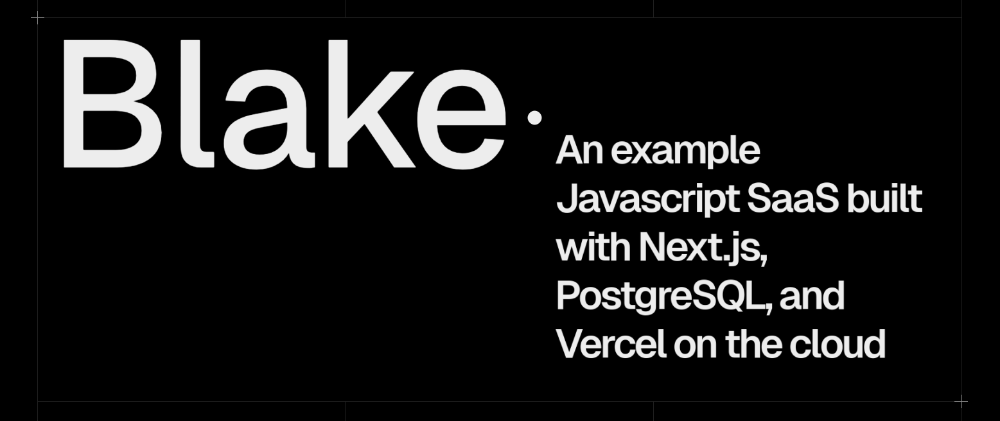

## Installing 
```
yarn install
```

## Configuration

NOTE: 
- Get Postgres-related env vars from your Vercel project under "Project Settings" -> "Environment Variables"
- Github and Google OAuth vars from your account
  - Github: https://github.com/settings/developers
  - Google: https://console.cloud.google.com/apis/dashboard

```
POSTGRES_DATABASE=""
POSTGRES_HOST=""
POSTGRES_PASSWORD=""
POSTGRES_PRISMA_URL=""
POSTGRES_URL=""
POSTGRES_URL_NON_POOLING=""
POSTGRES_URL_NO_SSL=""
POSTGRES_USER=""
GITHUB_CLIENT_ID=""
GITHUB_CLIENT_SECRET=""
GOOGLE_CLIENT_ID=""
GOOGLE_CLIENT_SECRET=""
```

## Running

```
yarn run dev
```

### DONE
- [x] rename entries
- [x] add notes
- [x] top level "lists" panel
- [x] 1st-class spotify-style lists modal
- [x] show archived
- [x] upvote/downvote
- [x] updated to Next.js 14
- [x] replaced mui w/ franken/ui
- [x] virtual scrolling (perf. enhance long lists)
- [x] link to HN comments
- [x] include MUI
- [x] imports as updates 

## TODOs:
**Navigation**
  - [ ] filter/sort entries: alpha order, date added, frequency read, frequency suggested, upvotes/downvotes, favorites
  - [ ] search: fuzzy, strict, title, date range, tag, etc
  - [ ] supports ctrl-f for searching on page

**Per bookmark**
  Details/Metadata
  - [ ] summarize entries in a couple of sentences (AI?)
  
**Lists**
  - [ ] drag-n-drop to add to list
  - [ ] recommend other bookmarks like the current one
  - [ ] generate similar lists, create list from single

**Rest**
  - [ ] latest digest
  - [ ] export database into chrome format
  - [ ] "Reader View" simplified viewing
  - [ ] support twitter, reddit, youtube bookmarks/saved
  - [ ] support loading PDFs
  - [ ] EXTENSION: update bookmarks as they are added
  - [ ] EXTENSION: highlight and annotate page content
  - [ ] EXTENSION: load lists into tab groups
  - [ ] EXTENSION: bookmark tabs in groups

*Performance*
- [ ] paginate/stream bookmark data

